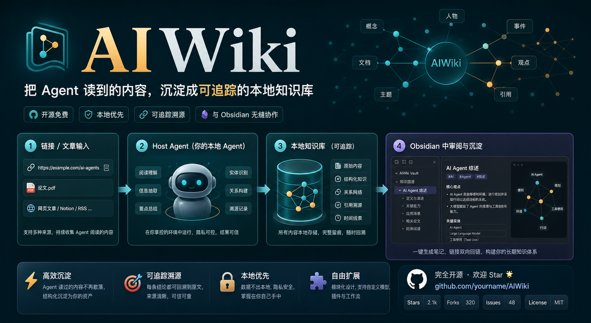

# AIWiki

AIWiki 是一个面向宿主 Agent 的本地知识库生产 CLI。用户把文章链接或正文发给 Codex、QClaw、OpenClaw、Claude Code 等 Agent，并使用“入库”触发词；宿主 Agent 负责读取网页或上下文，AIWiki 负责把内容写入本地知识库，并生成适合 Obsidian + Dataview 审阅的资料结构。

AIWiki 的重点不是替代 Agent 抓网页，而是把 Agent 已经读到的内容稳定沉淀为可追踪、可复盘、可继续写作的本地知识库。

## 最新动态

- `2026-05-09`：完成 npm 公开发布准备，补齐发布前的 README 与交付信息，并让 CLI 版本号与 `package.json` / 发布包保持一致，便于安装、排查与版本确认。
- `2026-05-08`：完成中文化体验收口，包括默认生成中文 prompt、中文状态输出、中文目标描述，以及 README 和使用文档的中文本地化。
- `2026-05-08`：强化 Obsidian 工作流，把 Review Queue、Claims Review 等审阅队列提升为一等入口，方便在知识库里持续审阅和回看入库内容。
- `2026-05-07`：新增 Codex skill 安装能力，并补上 Agent 协议安装引导，让宿主 Agent 在正式入库前更容易完成对接。
- `2026-05-07`：持续打磨初始化体验，修复 setup 提示问题，避免静默套用默认值，并把首次使用流程改成交互式引导。

## 安装与初始化

一次性运行交互式 setup：

```bash
npx @itradingai/aiwiki@latest setup
```

CLI 会询问知识库路径。直接回车会使用默认目录，确认后会创建或补齐 AIWiki 目录，并写入默认知识库配置。

自动化初始化可以使用：

```bash
npx @itradingai/aiwiki@latest setup --path "F:\knowledge_data\aiwiki" --yes
```

如果希望长期使用全局命令：

```bash
npm install -g @itradingai/aiwiki@latest
aiwiki setup
```

升级到最新版本：

```bash
npm install -g @itradingai/aiwiki@latest
```

要求 Node.js `>=20`。

## 让宿主 Agent 学会 AIWiki

初始化知识库后，先扫描本机支持的宿主 Agent：

```bash
aiwiki agent list
```

再启动安装向导：

```bash
aiwiki agent install
```

也可以直接指定目标：

```bash
aiwiki agent install --agent codex --yes
aiwiki agent install --agent qclaw --yes
aiwiki agent install --agent openclaw --yes
aiwiki agent install --agent claude --yes
```

如果当前宿主 Agent 暂不支持自动安装，可以输出通用对接协议：

```bash
aiwiki prompt agent
```

把输出内容安装成宿主 Agent 的 skill，或粘贴到宿主 Agent 的项目/会话说明里。

## 入库流程

完成 setup 和 Agent 安装后，对宿主 Agent 发送：

```text
入库 https://example.com/article
```

宿主 Agent 读取网页后，通过 `aiwiki ingest-agent --stdin` 把结构化内容交给 AIWiki CLI。用户不需要手动保存 payload，也不需要每次输入 `--path`。

典型流程：

```text
用户发送链接 -> 宿主 Agent 读取内容 -> Agent 调用 AIWiki -> AIWiki 写入本地知识库 -> Obsidian 审阅和沉淀
```

## Obsidian 与 Dataview

AIWiki 初始化时会创建面向 Obsidian 的目录、Dashboard、Dataview 查询和 frontmatter 约定。核心入口包括：

- `dashboards/AIWiki Home.md`
- `dashboards/Review Queue.md`
- `dashboards/Claims Review.md`
- `_system/schemas/aiwiki-frontmatter.md`

完整方案见：[docs/OBSIDIAN_DATAVIEW_PLAN.md](docs/OBSIDIAN_DATAVIEW_PLAN.md)。

## 常用命令

```bash
aiwiki setup
aiwiki setup --path <path> --yes
aiwiki agent list
aiwiki agent install
aiwiki prompt agent
aiwiki doctor
aiwiki status
aiwiki ingest-agent --stdin
aiwiki ingest-file --file <file>
```

高级/调试命令：

```bash
aiwiki init --path <path> --yes --set-default
aiwiki config show
aiwiki ingest-agent --payload <file>
aiwiki ingest-url <url> --content-file <file>
```

## 当前范围

- 单知识库
- 单次处理一条输入
- 宿主 Agent 读取网页、附件或正文
- CLI 写入本地文件和 Obsidian 友好的结构
- 生成资料卡、素材建议、主题候选、草稿大纲、处理摘要

## 当前不包含

- CLI 内置通用网页抓取
- 跨主题自动路由
- 批处理
- 定时或指定采集
- 长流程状态机
- 技术支持流程

## 文档

- 使用说明：[docs/USAGE.md](docs/USAGE.md)
- Agent 对接协议：[docs/AGENT_HANDOFF.md](docs/AGENT_HANDOFF.md)
- Obsidian + Dataview 方案：[docs/OBSIDIAN_DATAVIEW_PLAN.md](docs/OBSIDIAN_DATAVIEW_PLAN.md)
- 架构图：[docs/architecture.svg](docs/architecture.svg)

## 联系与交流

项目专题介绍：[maxking.cc](https://maxking.cc/aiwiki)

<table>
  <tr>
    <td align="center" width="50%">
      
      <br>
      <strong>扫码进群</strong>
    </td>
    <td align="center" width="50%">
      
      <br>
      <strong>关注公众号</strong>
    </td>
  </tr>
</table>

## 本地开发

```bash
npm install
npm run build
npm link
aiwiki setup --path "F:\knowledge_data\aiwiki-test" --yes
aiwiki prompt agent
aiwiki doctor
```

## License

MIT. See [LICENSE](LICENSE).
